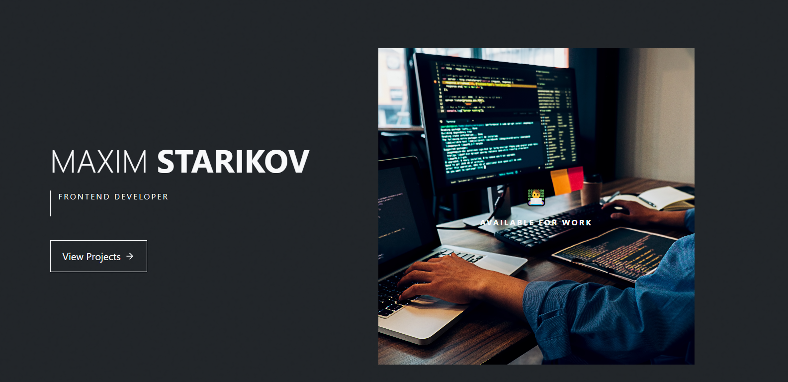

# Maxim Starikov - Portfolio



Современное минималистичное портфолио фронтенд-разработчика в черно-белом стиле с анимациями.

## Особенности

- Чистый черно-белый дизайн
- Плавные анимации при скролле
- Адаптивный интерфейс
- Эффекты при наведении
- Секции: Главная, Проекты, Обо мне, Контакты

## Технологии

- React
- React Bootstrap
- React Icons
- CSS анимации

## Установка

1. Клонировать репозиторий:
```bash
git clone https://github.com/yourusername/portfolio.git